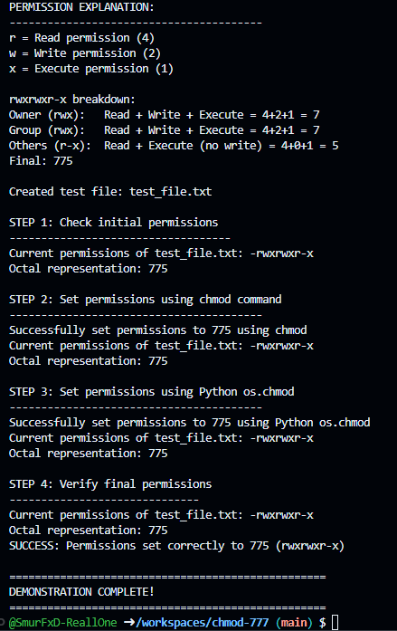

# Linux File Permissions Implementation

## Table of Contents
- [Project Overview](#project-overview)
- [What This Implementation Covers](#what-this-implementation-covers)
- [Files Included](#files-included)
- [How to Run](#how-to-run)
- [Learning Objectives](#learning-objectives)
- [Security Note](#security-note)
- [Reference](#reference)

## Project Overview
**A comprehensive implementation demonstrating Linux file permissions understanding, including visual flowchart creation and practical chmod command application in Python to achieve `rwxrwxr-x` permissions**

## What This Implementation Covers

This professional implementation demonstrates mastery of:

### 1. File Permissions Understanding
- **Owner permissions**: Read, Write, Execute
- **Group permissions**: Read, Write, Execute  
- **Others permissions**: Read, Execute (no write)

### 2. Permission Notation
- **Symbolic**: `rwxrwxr-x`
- **Octal**: `775`
- **Breakdown**:
  - Owner: `rwx` = 4+2+1 = 7
  - Group: `rwx` = 4+2+1 = 7
  - Others: `r-x` = 4+0+1 = 5

### 3. chmod Command Implementation
- **Purpose**: Change file permissions
- **Usage**: `chmod 775 filename`
- **Python equivalent**: `os.chmod(filename, 0o775)`

## Files Included

### 1. `file_permissions_flowchart.py`
A comprehensive Python implementation that demonstrates:
- **Text-based flowchart** explaining file permissions
- **Permission breakdown** and detailed explanation
- **chmod command usage** via subprocess
- **Python os.chmod** implementation
- **Permission verification** and validation

### 2. `permissions_flowchart.txt`
Simple text-based flowchart for reference

### 3. `README.md` (this file)
Complete documentation and project explanation

## How to Run

### Prerequisites
- Python 3.x
- Unix-like system (Linux, macOS, WSL) for chmod command

### Execution
```bash
python3 file_permissions_flowchart.py
```

### Expected Output
The implementation will:
1. Display a comprehensive flowchart explaining file permissions
2. Create a test file for demonstration
3. Show initial permissions
4. Set permissions using chmod command
5. Set permissions using Python os.chmod
6. Verify the final permissions are `775` (rwxrwxr-x)

### Sample Output
```
FILE PERMISSIONS AND CHMOD DEMONSTRATION
==================================================

[Flowchart displayed here]

Created test file: test_file.txt

STEP 1: Check initial permissions
Current permissions of test_file.txt: -rw-rw-rw-
Octal representation: 666

STEP 2: Set permissions using chmod command
Successfully set permissions to 775 using chmod
Current permissions of test_file.txt: -rwxrwxr-x
Octal representation: 775

SUCCESS: Permissions set correctly to 775 (rwxrwxr-x)
```

## Learning Objectives

This project successfully demonstrates:
1. **Deep understanding of Linux file permission system**
2. **Ability to create visual representations (flowcharts)**
3. **Proficiency in using chmod command effectively**
4. **Implementation of file operations in Python**
5. **Verification and validation of permission changes**

## Security Note

The permission `775` (rwxrwxr-x) is commonly used for:
- **Scripts** that need to be executed by group members
- **Directories** that need group write access
- **Shared files** in collaborative environments

**Remember**: Never use `chmod 777` (rwxrwxrwx) as it's a security risk!



*When someone says "chmod 777 fixed it" - This meme perfectly captures why using `chmod 777` is a terrible security practice!*

## Reference
- YouTube Video: https://youtu.be/LnKoncbQBsM?si=IfV4m31fDSf5Ctw 